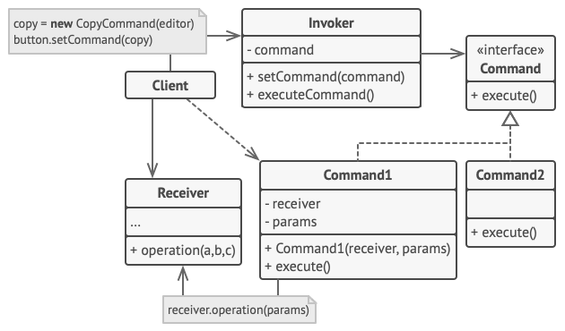

## Behavioral patterns

### Chain of Responsibility
### Command
**Command** is a behavioral design pattern that turns a request into a stand-alone object that contains all information about the request. This transformation lets you pass requests as a method arguments, delay or queue a request’s execution, and support undoable operations.

See more [Command...](behavioral/command.md)

### Iterator
### Mediator
Define an object that encapsulates how a set of objects interact.
**Mediator** promotes loose coupling by keeping objects from referring to each other explicitly,
and it allows their interaction to vary independently.

See more [Mediator...](behavioral/mediator.md)

### Memento
### Observer
**Observer** is a behavioral design pattern that lets you define a subscription mechanism to notify multiple objects about any events that happen to the object they’re observing.

The object that has some interesting state is often called subject, but since it’s also going to notify other objects about the changes to its state, we’ll call it publisher. All other objects that want to track changes to the publisher’s state are called subscribers.

See more [Mediator...](behavioral/observer.md)
### State
### Strategy
**Strategy** is a behavioral design pattern that lets you define a family of algorithms, put each of them into a separate class, and make their objects interchangeable.

See more [Strategy...](behavioral/strategy.md)

### Template Method
### Visitor