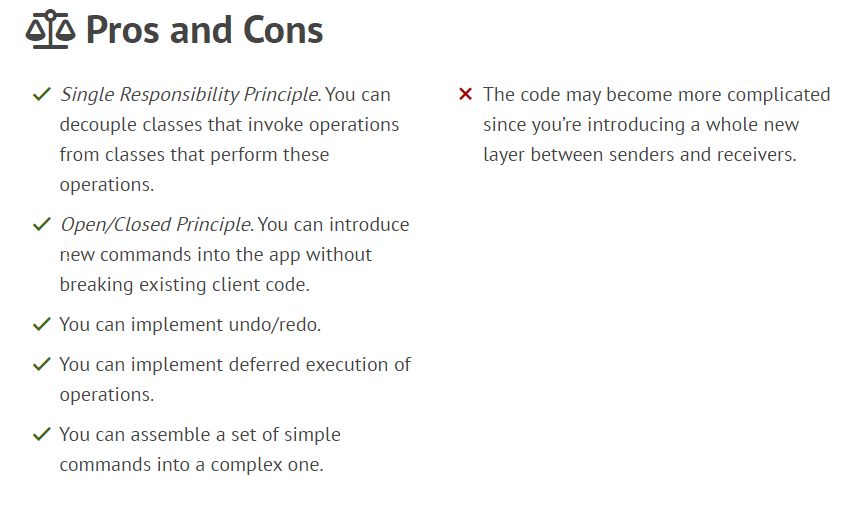

### Command
**Command** is a behavioral design pattern that turns a request into a stand-alone object that contains all information about the request. This transformation lets you pass requests as a method arguments, delay or queue a request’s execution, and support undoable operations.

Example:

#### Usage
- Use the Command pattern when you want to parametrize objects with operations.
- Use the Command pattern when you want to queue operations, schedule their execution, or execute them remotely.
- Use the Command pattern when you want to implement reversible operations.

Command

    What's the pattern structure?
    Explain how to undo features that can be implemented using the command pattern.

#### Links
https://dzone.com/articles/design-patterns-command