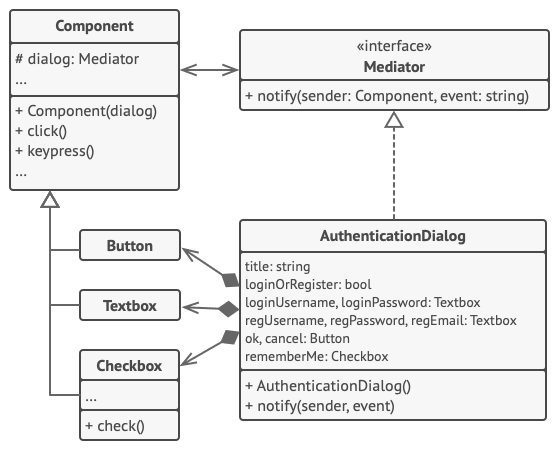
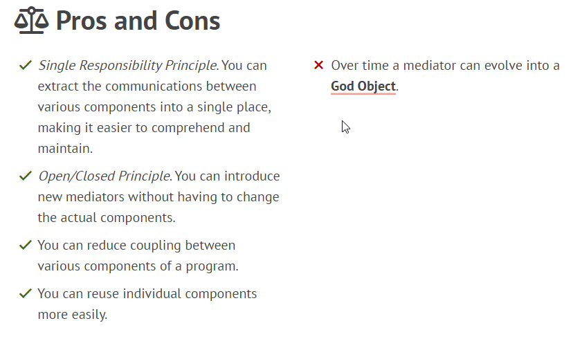

### Mediator
Define an object that encapsulates how a set of objects interact.
**Mediator** promotes loose coupling by keeping objects from referring to each other explicitly,
and it allows their interaction to vary independently.

#### Example:

#### Advices
- Use the Mediator pattern when it’s hard to change some of the classes because they are tightly coupled to a bunch of other classes.
- The pattern lets you extract all the relationships between classes into a separate class, isolating any changes to a specific component from the rest of the components.

- Use the pattern when you can’t reuse a component in a different program because it’s too dependent on other components.
- After you apply the Mediator, individual components become unaware of the other components. They could still communicate with each other, albeit indirectly, through a mediator object. To reuse a component in a different app, you need to provide it with a new mediator class.

- Use the Mediator when you find yourself creating tons of component subclasses just to reuse some basic behavior in various contexts.
- Since all relations between components are contained within the mediator, it’s easy to define entirely new ways for these components to collaborate by introducing new mediator classes, without having to change the components themselves.

### Training course notes
The project description from training course says us that we need to implement Mediator.
Mediator - HomeController
Components - Home Devices

But there are no homeController field in the components. 
Let's see what it will be.