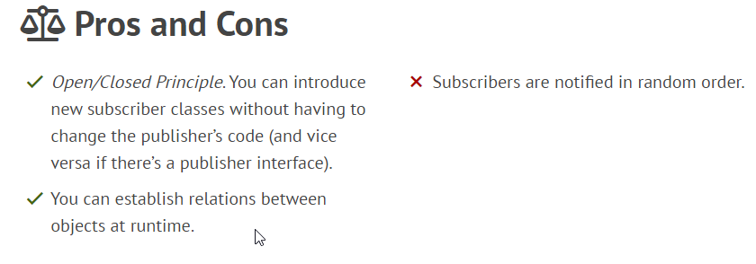

### Observer
**Observer** is a behavioral design pattern that lets you define a subscription mechanism to notify multiple objects about any events that happen to the object they’re observing.

The object that has some interesting state is often called subject, but since it’s also going to notify other objects about the changes to its state, we’ll call it publisher. All other objects that want to track changes to the publisher’s state are called subscribers.

Example:

#### Relations with Other Patterns
**Chain of Responsibility**, **Command**, **Mediator** and **Observer** address various ways of connecting senders and receivers of requests:

- **Chain of Responsibility** passes a request sequentially along a dynamic chain of potential receivers until one of them handles it.
- **Command** establishes unidirectional connections between senders and receivers.
- **Mediator** eliminates direct connections between senders and receivers, forcing them to communicate indirectly via a mediator object.
- **Observer** lets receivers dynamically subscribe to and unsubscribe from receiving requests.

The difference between **Mediator** and **Observer** is often elusive. In most cases, you can implement either of these patterns; but sometimes you can apply both simultaneously. 