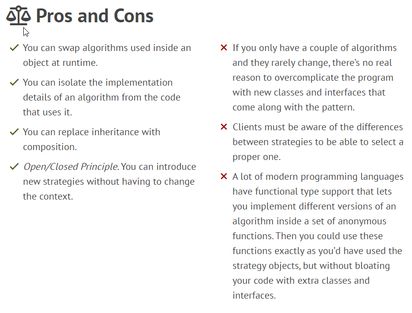

### Strategy
**Strategy** is a behavioral design pattern that lets you define a family of algorithms, put each of them into a separate class, and make their objects interchangeable.

Example:

#### Usage:
- Use the Strategy pattern when you want to use different variants of an algorithm within an object and be able to switch from one algorithm to another during runtime.
- Use the Strategy when you have a lot of similar classes that only differ in the way they execute some behavior.
- Use the pattern to isolate the business logic of a class from the implementation details of algorithms that may not be as important in the context of that logic.
- Use the pattern when your class has a massive conditional operator that switches between different variants of the same algorithm.
  - The Strategy pattern lets you do away with such a conditional by extracting all algorithms into separate classes, all of which implement the same interface. The original object delegates execution to one of these objects, instead of implementing all variants of the algorithm.

