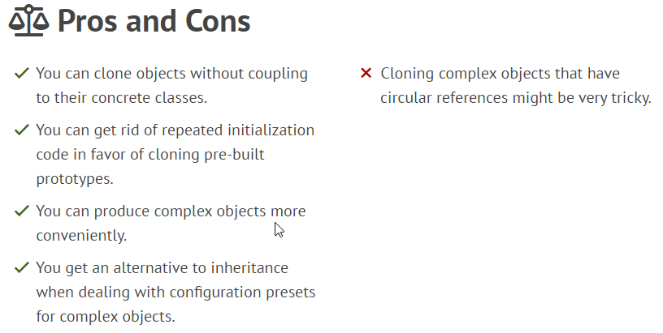
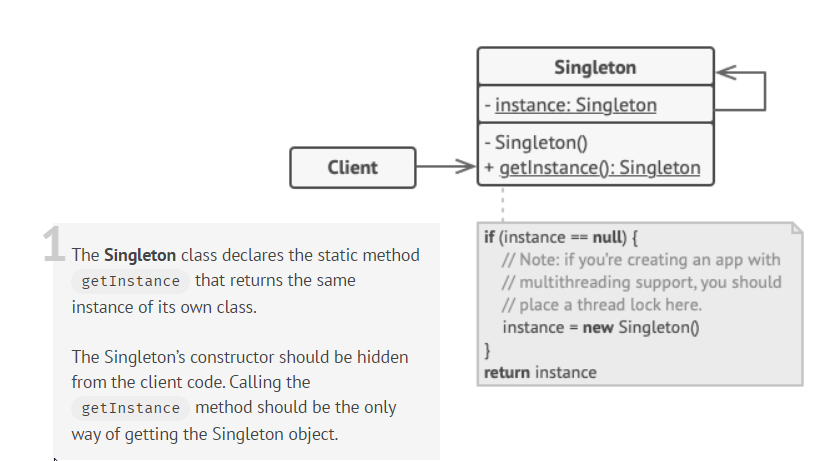
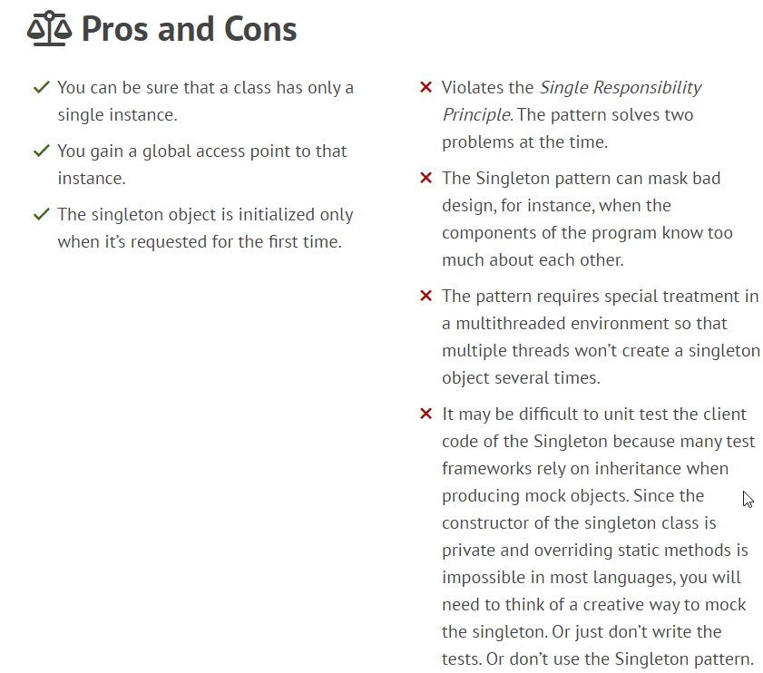

## Creational patterns
[1](1)
### Factory Method
The **Factory Method** design pattern solves problems like:
- How can an object be created so that subclasses can redefine which class to instantiate?
- How can a class defer instantiation to subclasses?

Structure:

See more [Factory Method...](creational/factory-method.md)

### Abstract Factory
Abstract Factory is a creational design pattern that lets you produce families of related objects without specifying their concrete classes.

The **main** difference between **Factory Method**(FM) and **Abstract Factory Method**(AFM): 
AFM uses factories that created with their own group of products.
So FM creates one product, AFM creates many products.
AFM implements interface, FM extends abstract class,
but I think that there are no objections to extends classes in AFM instead of using implementation.

See more [Abstract Factory Method...](creational/abstract-factory-method.md)

### Builder
The **Builder** pattern is useful when we want to construct a complicated object in a more flexible manner.
It works by having a separate class that we use for building our complicated object and allowing the client to create this with a simpler interface.

See more [Abstract Factory Method...](creational/builder.md)

### Prototype
Prototype is a creational design pattern that lets you copy existing objects without making your code dependent on their classes.

  
Click to expand!

The Prototype pattern delegates the cloning process to the actual objects that are being cloned. The pattern declares a common interface for all objects that support cloning. This interface lets you clone an object without coupling your code to the class of that object. Usually, such an interface contains just a single clone method.

The implementation of the clone method is very similar in all classes. The method creates an object of the current class and carries over all of the field values of the old object into the new one. You can even copy private fields because most programming languages let objects access private fields of other objects that belong to the same class.

An object that supports cloning is called a prototype. When your objects have dozens of fields and hundreds of possible configurations, cloning them might serve as an alternative to subclassing.

- Use the Prototype pattern when your code shouldn’t depend on the concrete classes of objects that you need to copy.
- Use the pattern when you want to reduce the number of subclasses that only differ in the way they initialize their respective objects.

### Singleton
The Singleton pattern solves two problems at the same time, violating the Single Responsibility Principle:
1. Ensure that a class has just a single instance. Why would anyone want to control how many instances a class has? The most common reason for this is to control access to some shared resource—for example, a database or a file.
2. Provide a global access point to that instance.

  
Click to expand!

