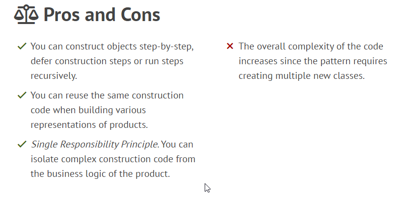

### Builder
The **Builder** pattern is useful when we want to construct a complicated object in a more flexible manner.
It works by having a separate class that we use for building our complicated object and allowing the client to create this with a simpler interface.

The Builder pattern suggests that you extract the object construction code out of its own class and move it to separate objects called builders.

#### Differenties with Abstract Factory Method:
- We configure created object `Product`, e.g. set field values, define the order of operations, etc.
- `Director` added if we have different approaches to create(configure) `Product` result object.
In that case we extract this logic to Director class.

The same in other words:\
- **Builder** focuses on constructing complex objects step by step.
- **Abstract Factory** specializes in creating families of related objects. 
**Abstract Factory** returns the product immediately, 
whereas **Builder** lets you run some additional construction steps before fetching the product.

