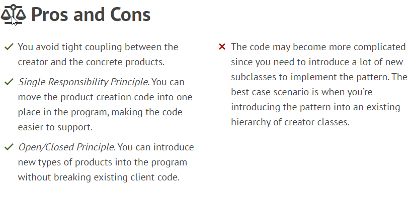

### Factory Method
The **Factory Method** design pattern solves problems like:
- How can an object be created so that subclasses can redefine which class to instantiate?
- How can a class defer instantiation to subclasses?

Structure:

Example:

At first glance, this change may look pointless: we just moved the constructor call from one part of the program to another. However, consider this: now you can override the factory method in a subclass and change the class of products being created by the method.

The code that uses the factory method (often called the client code) doesn’t see a difference between the actual products returned by various subclasses.
The client treats all the products as abstract `Product`.
The client knows that all _product_ objects are supposed to have the `doStaff()` method,
but exactly how it works isn’t important to the client.

Many designs start by using **Factory Method** (less complicated and more customizable via subclasses)
and evolve toward **Abstract Factory**, **Prototype**, or **Builder** (more flexible, but more complicated).