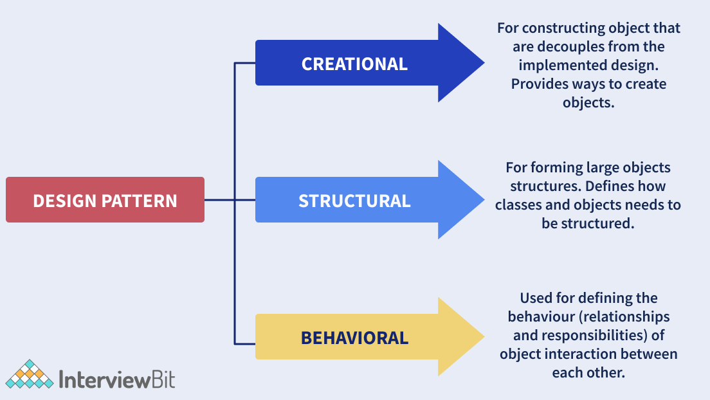
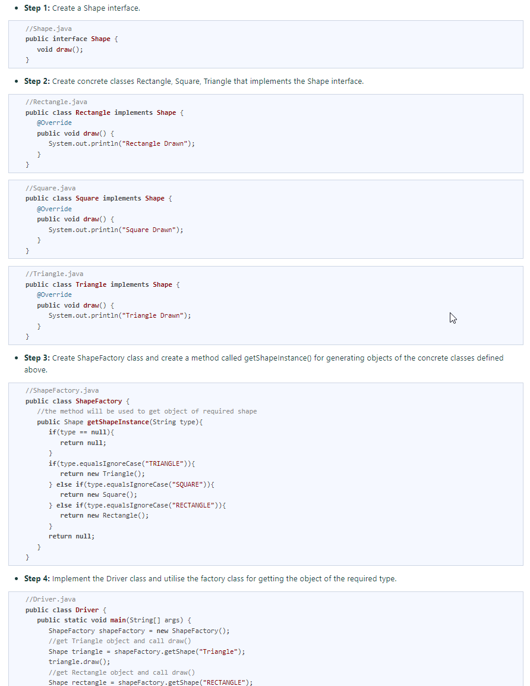

## Lecture

- [Good Practice](#good-practice)
- [Questions](#questions)

### What is design patterns?
Design patterns are typical solutions to common problems in software design. Each pattern is like a blueprint that you can customize to solve a particular design problem in your code.

You can’t just find a pattern and copy it into your program, the way you can with off-the-shelf functions or libraries. The pattern is not a specific piece of code, but a general concept for solving a particular problem. You can follow the pattern details and implement a solution that suits the realities of your own program.

Tell about the same pattern can differ in the different books or articles. 
Or for example the answer about the same question in different sources can be 
different for the same pattern.

Example: 
_Which pattern provides greater abstraction than factory pattern?_  
Abstract factory provides better abstraction as it encapsulates a group of individual factories.

### Benefits of patterns

Patterns are a toolkit of solutions to common
problems in software design. They define
a common language that helps your team
communicate more efficiently.

1. Even if you never encounter these problems, knowing patterns is still useful because it teaches you how to solve all sorts of problems using principles of object-oriented design.
2. Design patterns define a common language that you and your teammates can use to communicate more efficiently. You can say, “Oh, just use a Singleton for that,” and everyone will understand the idea behind your suggestion. No need to explain what a singleton is if you know the pattern and its name.

### Classification
The most universal and high-level patterns are architectural patterns. Developers can implement these patterns in virtually any language. Unlike other patterns, they can be used to design the architecture of an entire application.

In addition, all patterns can be categorized by their purpose. There are three main groups of patterns:
- **[Creational patterns](creational-patterns.md)** provide object creation mechanisms that increase flexibility and reuse of existing code.
- **[Structural patterns](structural-patterns.md)** explain how to assemble objects and classes into larger structures, while keeping these structures flexible and efficient.
- **[Behavioral patterns](behavioral-patterns.md)** take care of effective communication and the assignment of responsibilities between objects.

#### <h4 id="good-practice">Good Practice</h4>
- Start with the most simple design patterns,
  then you can refactor code if you will understand that you need more complex approach.
### ----------------------------------------------

### Criticism of patterns
- **Inefficient solutions**: Patterns try to systematize approaches that are already widely used. This unification is viewed by many as a dogma and they implement patterns “to the point”, without adapting them to the context of their project.
- **Unjustified use**: This is the problem that haunts many novices who have just familiarized themselves with patterns. Having learned about patterns, they try to apply them everywhere, even in situations where simpler code would do just fine.

### <h3 id="questions">Questions</h3>
1. **What are design patterns?**
   Design patterns are the reusable solutions that solve common problems of software development. These problems include repetitive code, redundant functions and logic etc. These help to save considerable effort and time required for the developers while developing software. Design patterns are commonly used in object-oriented software products by incorporating best practices and promoting reusability for developing robust code.
2. **What are the advantages of Java Design Patterns?**   
Design patterns are template-based reusable solutions to help developers work effortlessly in multiple projects. In Java, the design patterns are flexible and help to identify unwanted repetitive code easily. The architecture of the software can be customised as per the requirements. Some of the advantages of using design patterns in Java are:
   - They are reusable and can be used in multiple projects.
   - They provide template solutions for defining system architecture.
   - They provide transparency to software design.
   - They are well-tested and proven means of developing robust solutions effortlessly.
3. **What are the types of design patterns in Java?**
   There are three types of design patterns. They are:
   - **Creational Patterns**: These patterns provide freedom of choice between creating objects by hiding the logic. The objects constructed are decoupled from the implemented system. Some of the examples of creational patterns are - Factory design pattern, Builder design, Prototype design, Singleton design, Abstract Factory design.
   - **Structural Patterns**: These patterns help in defining how the structures of classes and objects should be like for defining the composition between classes, interfaces and objects. Some of the examples of structural patterns are - Adaptor design, Facade design, Decorator design, proxy design etc.
   - **Behavioural Patterns**: These patterns help to define how the objects should communicate and interact with one another. Some of the examples of behavioural patterns are - Command pattern, Iterator pattern, Observer pattern, Strategy pattern, etc.
4. **How are design principles different from design patterns?**
   - **Design principles** are those principles that are followed while designing software systems for any platform by making use of any programming language. SOLID principles are the design principles that we follow as guidelines to develop robust, extensible and scalable software systems. These apply to all aspects of programming.
   - **Design Patterns** are the reusable template solutions for commonly occurring problems that can be customized as per the problem requirements. These are well-implemented solutions that are tested properly and are safe to use. Factory Design Pattern, Singleton pattern, Strategy patterns are a few of the examples of design patterns.
5. **What is a Factory Design Pattern?** 
   Factory design pattern belongs to the category of Creational Design Patterns.  Here, the objects are created without exposing the logic of creation to the client. The objects refer to the common interface.
   

      
Code Example

        Now to implement the factory design pattern for the above example, let us follow the below steps:
      
   
   

6. **What is an Adapter Design Pattern?** 
   The adapter design pattern falls under the category of a structural design pattern that lets incompatible objects collaborate. It acts as a wrapper between 2 different objects. The adapter catches the call for one object and transforms them to be recognizable by the second object.
7. **What is the main advantage of using a prototype design pattern over object creation using a new keyword?** 
   Prototype design pattern is used for creating duplicate objects based on the prototype of the already existing object using cloning. Doing this has a positive impact on the performance of object creation. Creating objects using the new keyword requires a lot of resources and is a heavyweight process that impacts performance.
8. **What would happen if we do not have a synchronized method for returning Singleton instance in a multi-threaded environment?** 
   In a multi-threaded environment, if we have a non-synchronized method for returning instances, there are chances that the method can create more than one instance. Consider that we have 2 threads and both enter the condition for checking if the instance already exists. Both threads will find that the instance has not been created and hence both will create the class instances. This goes against the principle of the Singleton pattern. Hence, in a multi-threaded environment, it is recommended to use synchronized checks.
9. **What is a Proxy Design Pattern?** 
   Proxy design pattern falls under the category of structural design that represents the functionality of other classes. This pattern lets the developers provide a substitute for another object. This is called a proxy object. This helps to control the access to the original object and allows us to perform many tasks before or after the request reaches the original object.
10. **What is a Bridge Design Pattern?** 
    The bridge pattern is a type of structural design pattern that lets to split large class or closely related classes into 2 hierarchies - abstraction and implementation. These hierarchies are independent of each other and are used whenever we need to decouple an abstraction from implementation. This is called a Bridge pattern because it acts as a bridge between the abstract class and the implementation class. In this pattern, the abstract classes and the implementation classes can be altered or modified independently without affecting the other one.
11. **What is a Chain of Responsibility pattern? In what scenarios to apply this pattern?** 
    Chain of Responsibility belongs to the category of a behavioural design pattern that passes requests via a chain of handlers. Whenever a request is received, the handler decides whether to process the request or pass it to the next handler of the chain. It is used for achieving loose coupling where the client request is passed through an object chain to process them.
12. **What is Decorator Design Pattern?** 
    Decorator design pattern belongs to the category of structural pattern that lets users add new features to an existing object without modifying the structure. This pattern creates a class called decorator class that acts as a wrapper to the existing class by keeping the signatures of class methods intact. This pattern makes use of abstract classes and interfaces with composition for implementing the wrapper. They are mostly used to apply SRP (Single Responsibility Principle) as we divide functionalities into classes with unique concerns. This pattern is structurally similar to the chain of responsibility pattern.
13. **What is a Command pattern?** 
    The command pattern is a type of behavioural design pattern that transforms a request into a stand-alone object containing all the details about the request. This pattern is a data-driven pattern because we make use of the information about the request by wrapping it as an object and is passed to the invoker object as a command. The invoker object checks for the object that can handle the command and passes it to that object to execute the command.

1. Which among the following design patterns suggests a request to pass through multiple classes but only relevant classes should execute the request?
    - Factory Pattern
    - Chain of Responsibility Pattern*
    - Decorator Pattern
    - Strategy Pattern
2. Which among the below design patterns let the user add new functionality to an existing object without altering the structure of the object? 
   - Decorator Pattern*
   - Singleton Pattern
   - Factory Pattern
   - Abstract Factory Pattern
3. Which of the following design pattern is used for accessing elements of a collection object sequentially?
   - Iterator Pattern*
   - Strategy Pattern
   - Command Pattern
   - Proxy Pattern
4. Which of the following design pattern is used for defining the one to many dependencies among objects in a way that if one object’s state changes, the dependents are informed of it?
   - Strategy Pattern
   - Observer Pattern*
   - Proxy Pattern
   - Command Pattern
5. Which of the following design pattern provides a single class with simplified methods required by the client and delegate the call to those methods for processing the request?
   - Adapter pattern
   - Builder pattern
   - Prototype pattern
   - Facade pattern*
6. Which of the following design pattern is data-driven and the action is based on the data provided?
   - Singleton pattern
   - Facade pattern
   - Command pattern*
   - MVC pattern
7. Which of the following design pattern ensures only one object of a class is created?
   - Chain of responsibility pattern
   - Singleton pattern*
   - State pattern
   - Bridge pattern
8. Which of the following design pattern ensures development cost is minimized by reusing methods?
   - Immutable Pattern
   - Singleton Pattern
   - Adapter Pattern
   - Delegation pattern*

Questions - https://www.javapedia.net/Design-Patterns#qanda773
Patterns in JDK examples - https://stackoverflow.com/questions/1673841/examples-of-gof-design-patterns-in-javas-core-libraries 