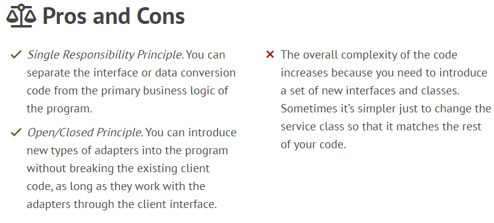

### Adapter
**Adapter** is a structural design pattern that allows objects with incompatible interfaces to collaborate.

#### Usages
- Use the Adapter class when you want to use some existing class, but its interface isn’t compatible with the rest of your code.
- Use the pattern when you want to reuse several existing subclasses that lack some common functionality that can’t be added to the superclass.
  This approach looks very similar to the **Decorator** pattern.

#### Relations with Other Patterns
- **Bridge** is usually designed up-front, letting you develop parts of an application independently of each other. On the other hand, **Adapter** is commonly used with an existing app to make some otherwise-incompatible classes work together nicely.
- **Adapter** changes the interface of an existing object, while **Decorator** enhances an object without changing its interface. In addition, **Decorator** supports recursive composition, which isn’t possible when you use **Adapter**.
- **Adapter** provides a different interface to the wrapped object, **Proxy** provides it with the same interface, and **Decorator** provides it with an enhanced interface.
- **Facade** defines a new interface for existing objects, whereas **Adapter** tries to make the existing interface usable. **Adapter** usually wraps just one object, while **Facade** works with an entire subsystem of objects.
- **Bridge**, **State**, **Strategy** (and to some degree **Adapter**) have very similar structures. Indeed, all of these patterns are based on composition, which is delegating work to other objects. However, they all solve different problems. A pattern isn’t just a recipe for structuring your code in a specific way. It can also communicate to other developers the problem the pattern solves.